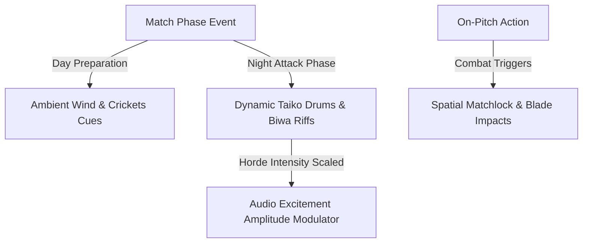

# Audio Design Document (ADD): Mobile Fortress
*Dynamic Taiko Drums, Atmospheric Nature Cues, and Spatial Combat Effects*

---

## 1. Acoustic Identity & Design Philosophy

Mobile Fortress relies on a traditional Japanese acoustic landscape designed to balance peaceful Day phases with intense Night sieges.

---

## 2. Dynamic Audio Systems

The soundtrack and ambient environmental loops adjust dynamically using a centralized **Excitement Scale** ($E \in [0.0, 1.0]$) monitored by the game loop:
$$E = w_1 \cdot \text{EnemiesOnScreen} + w_2 \cdot \text{CastleHealthLoss} + w_3 \cdot \text{BossPresence}$$

### 2.1 Day / Night Transition Loops
*   **Day Phase ($E < 0.2$)**: Smooth ambient wind sweeps, rustling bamboo trees, soft crickets, and occasional distant flutes (Shakuhachi).
*   **Night Phase (Start of wave)**: Rhythmic clapping, tension-building Biwa strings, and light percussion.
*   **Peak Siege ($E \ge 0.6$)**: Loud Taiko drum arrays, aggressive Shamisen strums, and shouting backing vocals, scaling in volume and speed as enemies approach the Keep.

---

## 3. Spatial Combat Audio

Sound effects are localized based on screen coordinates to help players recognize where breaches occur.

### 3.1 Weapon SFX Cues
1.  **Matchlock Gunners**: Loud, bass-heavy explosions with high high-frequency crackle, dropping in volume if fired off-screen.
2.  **Yumi Archers**: High-velocity arrow whistling sample, fading out at target coordinates.
3.  **Samurai Cleaves**: Metallic blade slashing sounds with organic body impacts.
4.  **Shaman Purifications**: Shimmering spiritual bell sounds (Kagura Suzu) played in a high-pitch loop.

---
*Document Version: 2.0*  
*Authoritative Reference: design/game_design_document.md*
