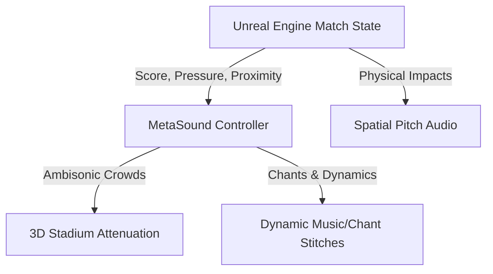

# Audio Design Document (ADD): AI Soccer Simulator (AISS)
*Spatial Audio Architectures, Dynamic Crowd Soundscapes, and Middleware specs in UE5*

---

## 1. Audio Architecture & System Overview

AISS utilizes a high-dynamic-range (HDR) audio system designed to simulate the acoustics of a massive sports stadium. The engine must seamlessly balance ambient crowd noise, acoustic reflections from concrete stands, and distinct on-pitch physical sounds.

---

## 2. Spatial Pitch Acoustics

On-pitch audio events are localized using distance-based attenuation curves and spatial filters.

### 2.1 Physics Collision Audio
*   **Ball-to-Boot Impacts**: Dynamic sound triggers mapping impact velocity to sample pitch and volume. Soft taps trigger dry leather brushing, while high-velocity shots trigger loud thuds.
*   **Net Swishes**: Spatially positioned line assets along the goal net trigger multi-channel swish sounds when intersected by high-velocity ball actors.
*   **Player Locomotion**: Footstep SFX are modulated by surface parameters (dry turf, wet turf, mud) and speed (walk, run, sprint).

### 2.2 Camera Zoom Attenuation
The listener position is attached to the broadcast camera. Attenuation models use a dynamic scale:
*   **Wide Broadcast Camera**: Low-pass filters are applied to on-pitch events; crowd acoustics are wide and diffuse.
*   **Close/Focus Camera**: Attenuation curves clamp crowd volumes (-6dB) and boost pitch events (+4dB) to highlight tactical details.

---

## 3. Dynamic Stadium Ambience

The stadium crowd is modeled as a multi-layered acoustic entity that shifts states based on match events.

### 3.1 Crowd Mood States
The system maintains a **Crowd Excitement Metric** ($E \in [0.0, 1.0]$) updated in real-time by scoreboard and tactical data:
$$E = w_1 \cdot \text{BallProximityToGoal} + w_2 \cdot \text{MatchTension} + w_3 \cdot \text{RecentEventModifier}$$

*   **State 0: Idle Murmur ($E < 0.3$)**: Low-frequency hum, distant chatter.
*   **State 1: Anticipation ($0.3 \le E < 0.7$)**: Mid-frequency cheers, rhythmic clapping, volume swell.
*   **State 2: Peak Roar ($E \ge 0.7$)**: High-frequency explosions, cheering waves, dynamic chanting.

### 3.2 Middleware Integration: MetaSounds & Wwise
*   **MetaSound Pipeline**: Native Unreal Engine MetaSounds generate complex sound layers directly in the engine.
*   **Interactive Music/Chant Stitching**: Crowds dynamically stitch chants based on the leading team. MetaSounds coordinate sample changes at bar/beat boundaries (utilizing the Quartz subsystems) to maintain rhythmic synchronization of crowd clapping.

---
*Document Version: 1.0*  
*Authoritative Reference: design/GDD.md*
