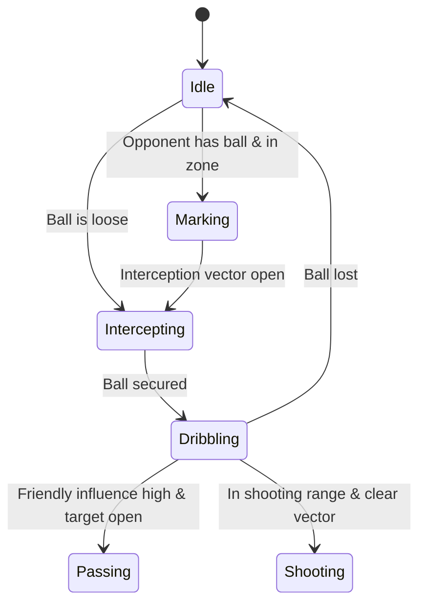

# Game Design Document (GDD): AI Soccer Simulator (AISS)
*Core Vision & Mechanics for an Autonomous UE5 Soccer Simulation*

---

## 1. Executive Summary & Core Loop

**AI Soccer Simulator (AISS)** is a high-fidelity, data-driven simulation game built in Unreal Engine 5. Unlike traditional soccer games where players directly control agents, AISS places the player in the role of the Manager/Director. Teams of fully autonomous, AI-driven player agents compete on the pitch, reacting dynamically to tactical instructions, player attributes, and physics-based environments in real-time.

```
+--------------------------------------------------------------+
|                    THE GAMEPLAY CORE LOOP                    |
+--------------------------------------------------------------+
|                                                              |
|   1. Setup & Strategy                                        |
|      - Set team formations (e.g., 4-3-3, 3-5-2).             |
|      - Assign player roles (e.g., Box-to-Box, Deep-Lying).   |
|                                                              |
|                             |                                |
|                             v                                |
|                                                              |
|   2. The Simulation                                          |
|      - Launch autonomous match.                              |
|      - Agents execute logic via Behavior Trees & Utility AI. |
|                                                              |
|                             |                                |
|                             v                                |
|                                                              |
|   3. Real-Time Intervention                                  |
|      - Adjust team mentalities (Attacking, Defensive).       |
|      - Shift pressure lines & passing style.                 |
|      - Make dynamic substitutions.                           |
|                                                              |
+--------------------------------------------------------------+
```

---

## 2. Core Mechanics

### 2.1 Physics-Based Pitch Simulation
*   **Ball Physics**: The ball is a fully simulated physical actor using Unreal Engine 5's PhysX/Chaos physics engine. Friction, bounce elasticity, wind drag, and grass dampening are calculated dynamically based on pitch conditions (e.g., wet, dry, mud).
*   **Collision Profiles**: Strict collision boxes for players' feet, legs, chest, and head, determining interception vectors.

### 2.2 Tactical Directives
The manager can execute real-time tactical changes that alter the underlying cost functions of the AI agents:
1.  **Defensive Line Height**: Adjusts the default vertical zone bounds of defender agents.
2.  **Passing Focus**: Shifts the weight of passing vectors toward the wings or center.
3.  **Pressing Intensity**: Modulates the distance threshold at which defender agents initiate intercept/tackle states.

---

## 3. Autonomous AI Agent Behaviors

Individual agents make decisions based on a hybrid **Behavior Tree** and **Utility AI (Influence Mapping)** framework.

### 3.1 Spatial Influence Mapping
The pitch is divided into a dynamic spatial grid where influence values are calculated at 10Hz:
*   **Friend Influence**: Sum of friendly player proximities weighted by their speeds.
*   **Foe Influence**: Sum of opponent player proximities.
*   **Pass Viability Vector ($P$)**:
    $$P = \text{Normalize}(A_{\text{target}} - A_{\text{current}}) \times \text{SafetyMargin}$$
    Safety margin decreases if opponents intersect the linear ray between current agent and target position.



---

## 4. Game State Machine Overview

The global simulation loop manages matches across these states:

| Simulation State | Description | Transition Trigger |
| :--- | :--- | :--- |
| **Pregame** | Renders stadium, loads team assets, awaits user launch. | User presses "Start Simulation". |
| **Kickoff** | Positions players, launches physics threads. | Referee whistle trigger. |
| **Active Play** | Simulates match ticks, runs AI behavior trees. | Ball out of bounds, foul, or goal. |
| **Set Piece** | Initiates corner kicks, penalties, or throw-ins. | Play completes. |
| **Postgame** | Calculates final performance statistics, dumps telemetry logs. | Final whistle trigger. |

---
*Document Version: 1.0*  
*Target Engine: Unreal Engine 5.4+*  
*Authoritative Reference: design/technical_design_document.md*
