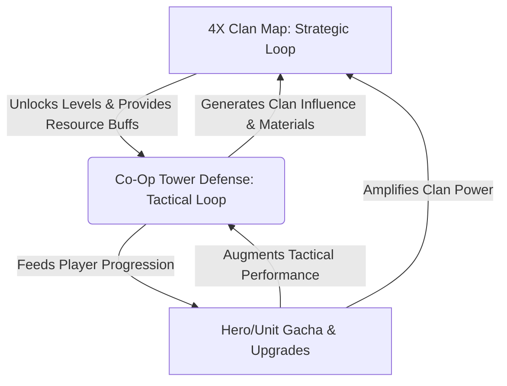
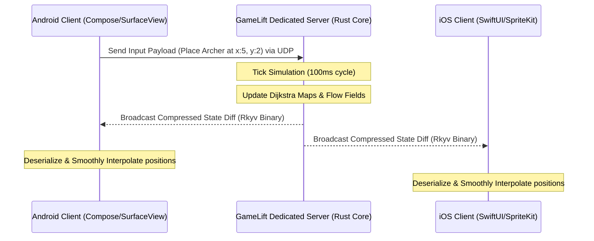
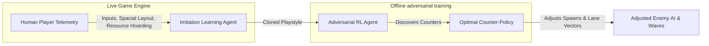

# Game Design Document (GDD): Mobile Fortress
*An In-Depth Blueprint for a Sengoku-Era Cooperative Tower Defense & 4X Strategy Game*

---

## 1. Executive Summary & Vision Statement

**Mobile Fortress** is a cooperative multiplayer 2D tower-defense and meta-4X game set during the Sengoku Jidai (1520s Feudal Japan). Players coordinate to defend a local Daimyo's castle and a sacred Maiden against waves of ashigaru, rival samurai clans, and Yokai-corrupted forces. Success in combat feeds into a regional 4X-style territory control game where player-run Clans cooperate to conquer provinces, build fortifications, and manage economic assets.

### 1.1 The Gameplay Hybridization Imperative
In accordance with contemporary market realities, pure tower-defense titles suffer from limited retention. Mobile Fortress addresses this via a dual-loop framework:
*   **The Tactical Loop (Action/TD)**: A high-fidelity, real-time cooperative 2D tower defense screen. It utilizes Native UI overlays enclosing a high-performance gameplay canvas powered by a shared headless simulation engine.
*   **The Strategic Loop (4X Clan Meta)**: A persistent, social-first political and military map of 1520s Japan. Clans capture territories, distribute resources, and coordinate multi-party attacks, driving long-term habit formation (D30+ retention).



### 1.2 Target Demographics & Motivations
*   **Primary Audience**: Mid-core strategy and RPG players (Male/Female, ages 18–45) seeking tactical depth without extreme cognitive exhaustion.
*   **Psychological Goal (UTAUT3 Alignment)**: Maximize **Hedonic Motivation** (visceral visual feedback, Ukiyo-e aesthetic) and **Social Influence** (guild-level obligations, joint castle defense) while minimizing **Effort Expectancy** (frictionless progression, auto-farm assistance, and clean native UI transitions).

---

## 2. Thematic Direction & Aesthetics

### 2.1 Visual Art Style (Ukiyo-e Woodblock)
*   **Aesthetic Identity**: The game utilizes a stylized, premium 2D design inspired by classical Japanese *Ukiyo-e* woodblock prints (reminiscent of Katsushika Hokusai and Utagawa Hiroshige). Characters and environments feature bold, dark line work, textured gradients, and parchment paper overlays.
*   **Visual Feedback**: Cleansing Yokai defilement causes the environment to shift from a dark, ash-choked monochromatic palette to vibrant, hand-painted colors, creating a highly satisfying sensory experience.

### 2.2 Auditory Landscape
*   **Instrumentation**: Traditional Japanese instrumentation forms the acoustic core: Taiko drums for high-intensity defense phases, Shakuhachi (bamboo flute) and Shamisen (lute) for peaceful day/building cycles, and a weeping Biwa to build tension before boss waves.
*   **Soundscapes**: Immersive natural audio (crickets chirping during day preparation, falling cherry blossom wind effects, crackling torowas/torches at night).

---

## 3. Core Gameplay Loop & Mechanics

### 3.1 The Day/Night Gameplay Cycle
Each combat encounter operates on a dynamic cycle:
*   **Day Phase (Preparation & Fortification)**: Players cleanse defilement, repair structures, collect resources, and coordinate placement.
*   **Night Phase (The Siege)**: Yokai-corrupted invaders assault the castle. Players dynamically shift hero positions, activate combat abilities, and manage real-time path obstructions to protect the central Keep and the Maiden.

### 3.2 Unit & Tower Classification
Towers are represented as active military units stationed along the castle battlements and pathways:
1.  **Ashigaru Spearmen (Melee/Blocker)**: Placed directly on paths. They slow down enemies and engage in melee combat, altering the local traversal cost.
2.  **Matchlock Gunners (Ranged/Piercing)**: Deal high linear damage but have slow reload speeds. Effective when aligned along long straightaways.
3.  **Yumi Archers (Ranged/Indirect)**: Fire over walls and terrain, dealing moderate single-target damage with high fire rates.
4.  **Samurai Heroes (Dynamic Units)**: Super-units with high mobility. Players can manually command them to relocate to reinforce failing lanes or execute active ultimate skills.
5.  **Shaman Priestesses (Support)**: Purify nearby corrupted paths, applying slows to Yokai and healing friendly units.

### 3.3 Flow-Field Pathfinding Engine
To support hundreds of enemy combatants simultaneously on mobile devices without battery drain or framerate stuttering, the pathfinding engine abandons classical $A^*$ in favor of a dynamic **Flow Field (Vector Field)**.

#### Pathfinding Mathematical Architecture
1.  **Integration Field (Dijkstra Map)**:
    A cost grid is maintained where traversable cells have a base cost of $1.0$, blocked cells have a cost of $\infty$, and slowed/muddy cells have a cost of $2.5$. Radiation outwards from the goal node $G$ calculates the total travel cost $C(p)$ for every grid point $p$:
    $$C(p) = \min_{n \in \text{Neighbors}(p)} \left( C(n) + \text{Cost}(p \to n) \right)$$
2.  **Flow Field Vector Generation**:
    The system calculates a normalized gradient vector field $V(p)$ indicating the optimal direction of movement for any entity situated on cell $p$:
    $$V(p) = -\nabla C(p) = -\left( \frac{\partial C}{\partial x}, \frac{\partial C}{\partial y} \right)$$
    In discrete terms, for a cell $(x, y)$, the vector pointing to the neighbor with the minimum integrated cost is computed:
    $$V(x, y) = \text{Normalize}\left( \arg\min_{dx, dy \in \{-1, 0, 1\}} C(x+dx, y+dy) - C(x, y) \right)$$
3.  **Dynamic Grid Updates**:
    When a player places a blocking unit (e.g., Ashigaru Spearmen barricade), the local cost changes. The Dijkstra map is recomputed locally using a queue-based boundary expansion. Enemy entities query the vector of the tile they currently occupy:
    $$\text{Velocity}_{\text{entity}} = V(\text{Tile}(x, y)) \times \text{Speed}_{\text{entity}}$$

```
[Spawn Gate] ---> [Tile (1.5, 0.5): Vector Right] ---> [Barricade: Cost 99.0]
                                                             | (Dijkstra recalculates)
                                                             v
                  [Tile (1.5, 0.5): Vector Down]  ---> [Purified Lane: Cost 1.0] ---> [Castle Keep]
```

---

## 4. Multiplayer Netcode & Cloud Orchestration

Mobile Fortress features a **Server-Authoritative State Synchronization** model running on a headless Rust simulation core, ensuring parity between Android and iOS clients.



### 4.1 Serialization & Data Transport
*   **rkyv (Zero-Copy Serialization)**: State updates are serialized into binary formats via Rust's `rkyv` crate. Deserialization overhead on native clients is bypassed by traversing the raw byte stream directly from the FFI memory layout (`RustBuffer`).
*   **Delta Compression**: The server only broadcasts changes (e.g., entity spawns, deaths, position updates) rather than the complete simulation frame, minimizing cellular bandwidth.

### 4.2 Cloud Orchestration via AWS GameLift FlexMatch
*   **Latency-Graduated Matchmaking**: Lobbies are assembled dynamically. The queue checks player pings to various AWS regions (e.g., `eu-west-1` in Ireland, `us-east-1` in Virginia). FlexMatch applies strict thresholds:
    *   *0–30s*: Latency $< 50\text{ms}$ (Strict regional routing).
    *   *30–60s*: Latency $< 90\text{ms}$ (Fallback to secondary regional clusters).
    *   *60s+*: Latency $< 120\text{ms}$ (Cross-continental lobby matching).
*   **Spot Instance Mitigation**: The game server fleet runs on a mix of 70% Spot and 30% On-Demand instances (primarily `c5.large` and `c5.xlarge`). If a Spot termination notice is issued:
    1.  The instance notifies the GameLift SDK.
    2.  The matchmaking queue diverts new sessions to On-Demand fleets.
    3.  Active game sessions on the terminating instance are allowed up to 2 minutes to complete or are cleanly saved and migrated during a wave break.

---

## 5. Algorithmic Procedural Content Generation (PCG)

To support long-term replayability, castle siege battlefields are dynamically generated using constraint-satisfaction algorithms.

```
+-------------------------------------------------------------+
|               PCG Environment Synthesis Pipeline            |
+-------------------------------------------------------------+
|                                                             |
|   1. Local Constraint Solver                                |
|      [Wave Function Collapse (WFC)]                         |
|      - Collapses tile superpositions based on local rules.  |
|      - Ensures cliff-to-cliff, road-to-road adjacency.      |
|                                                             |
|                             |                               |
|                             v                               |
|                                                             |
|   2. Global Structural Optimization                         |
|      [Mixed Integer Linear Programming (MILP)]              |
|      - Verifies path traversability from spawns to castle.  |
|      - Guarantees minimum path length and tactical metrics. |
|                                                             |
|                             |                               |
|                             v                               |
|                                                             |
|   3. Intelligent Editing Agent                              |
|      [PCGRL (Deep PPO Agent)]                               |
|      - Evaluates strategic depth (choke points, elevations).|
|      - Dynamically refines maps to match targeted difficulty.|
|                                                             |
+-------------------------------------------------------------+
```

### 5.1 Local Constraints: Wave Function Collapse (WFC)
*   **Superposition**: Every grid cell starts as a set of all possible terrain tiles (Grass, Mountain, Road, Forest, Wall).
*   **Entropy Minimization**: The tile with the lowest Shannon entropy is collapsed first. 
*   **Constraint Propagation**: Adjacency rules (e.g., "Roads cannot spawn adjacent to Cliffs") propagate outward, reducing the superposition of neighboring cells.

### 5.2 Global Constraints: MILP Solver
To prevent WFC from generating beautiful but unplayable loops or dead-ends, a Mixed Integer Linear Programming (MILP) model runs alongside the solver.
*   **Objective**: Maximize path strategic depth while ensuring a valid flow field exists from $S_{\text{spawn}}$ to $T_{\text{castle}}$.
*   **Decision Variables**: Binary variable $x_{ij} \in \{0, 1\}$ representing if cell $(i, j)$ contains a path tile.
*   **Flow Conservation Constraint**:
    $$\sum_{j} f_{ij} - \sum_{k} f_{ki} = \begin{cases} 1 & \text{if } i = S_{\text{spawn}} \\ -1 & \text{if } i = T_{\text{castle}} \\ 0 & \text{otherwise} \end{cases}$$
    This guarantees that a path is always mathematically traversable.

### 5.3 Strategic Optimization: PCGRL (RL-based Map Generation)
A Deep Reinforcement Learning agent (trained via PPO) edits the WFC output to place optimal tactical points (chokepoints, towers, elevated sniper zones).
*   **State Space ($S$)**: A 2D grid containing local cell heights, path vectors, and tower coverage matrices.
*   **Action Space ($A$)**: Select cell $(x, y)$ and apply action (Raise elevation, Add bridge, Clear path).
*   **Reward Function ($R$)**:
    $$R = w_1 \cdot (\text{Path Length}) + w_2 \cdot (\text{Count of Chokepoints}) - w_3 \cdot (\text{Redundant Paths})$$

---

## 6. AI-Driven Dynamic Difficulty Adjustment (DDA)

To prevent player churn caused by boredom (game too easy) or frustration (game too hard), Mobile Fortress utilizes an automated, continuous difficulty calibration engine.



### 6.1 Two-Agent Neural Network Framework
*   **Imitation Agent (The Shadow Clone)**:
    Observes player metrics (average response time to breaches, placement clusters, resource spending velocity, upgrade priority). The agent undergoes supervised training to replicate the player's playstyle in real-time.
*   **Competition Agent (The Tactician)**:
    Runs in the background, playing against the Imitation Agent. It searches for optimal wave mixtures (e.g., spawning fast-moving Tengu Yokai to exploit a player's lack of slowing shamans).
*   **Implementation**: Once the Competition Agent finds a counter-strategy, the game engine adapts wave spawning metrics. This creates a highly personalized, dynamic threat index without altering basic enemy health or damage values.

### 6.2 Continuous Modulation via PPO
The DDA system modulates continuous factors (spawn rate modifiers, pathfinding reaction delays, stealth unit visibility radii) using Proximal Policy Optimization:
*   **Tension Reward Model**: The RL reward is maximized when the player's Castle health drops below 30% but recovers to win, maintaining a state of high physiological arousal and hedonic enjoyment.

---

## 7. LiveOps, Retention & Monetization

### 7.1 Offer Personalization: Contextual Multi-Armed Bandits (CMAB)
Rather than statically offering microtransactions, the game uses the **LinUCB** algorithm to determine the optimal resource or cosmetic bundle to offer a player during wave breaks.

#### LinUCB Mathematical Formulation
For each user context vector $x_{a}$ (containing D1–D7 retention flags, current coin deficit, favorite class usage ratio, and past purchase history):
1.  Estimate the expected conversion probability for each store offer $a$:
    $$p_{t, a} \equiv x_{t, a}^T \hat{\theta}_a + \alpha \sqrt{x_{t, a}^T A_a^{-1} x_{t, a}}$$
    Where $A_a = D_a^T D_a + I_d$ (the covariance matrix of historical context values), $\hat{\theta}_a$ represents the ridge regression weights of arm $a$, and $\alpha$ is a hyperparameter managing the balance of exploration vs exploitation.
2.  The store displays the bundle $a_t$ maximizing the upper confidence bound:
    $$a_t = \arg\max_{a} \left( x_{t, a}^T \hat{\theta}_a + \alpha \sqrt{x_{t, a}^T A_a^{-1} x_{t, a}} \right)$$

### 7.2 Early Churn Forecasting (Weibull Survival Analysis)
To prevent players from churning before D30, a parametric survival model forecasts time-to-churn:
$$S(t | x) = \exp\left( -\left( \lambda(x) \cdot t \right)^\beta \right)$$
Where $\lambda(x) = \exp(\gamma^T x)$ scales based on context parameters (e.g., number of failed co-op matches, average time spent waiting in matchmaking). If $S(\text{Day 14}) < 0.35$, the backend triggers an automated retention event:
*   Granting a free temporary Legendary Samurai hire.
*   Issuing a cooperative clan assistance quest.

### 7.3 Community Stability: Temporal Graph Neural Networks (TGNN)
*   **Player Social Graph**: Nodes represent players; edges represent cooperative games played together.
*   **Churn Cascade Mitigation**: When a highly active hub node (e.g., a Clan Leader or active raid coordinator) shows signs of high churn risk, the TGNN flags all connected neighbor nodes. The server automatically routes group buffs and shared clan milestones to that network cluster to preserve community ties.

---

## 8. Mathematical Optimization Methods (Swarm Intelligence & Evolutionary Algorithms)

To support complex strategic systems in both the 4X Strategic Loop and procedural content generation, Mobile Fortress implements classical mathematical optimization methods alongside its machine learning models.

```
+-------------------------------------------------------------+
|        Mathematical Optimization Systems Overview           |
+-------------------------------------------------------------+
|                                                             |
|   1. Genetic Algorithms (GA)                                |
|      [Procedural Level Design]                              |
|      - Optimizes castle wall barricade structures.          |
|      - Maximizes pathing distance within budget constraint. |
|                                                             |
|                             |                               |
|                             v                               |
|                                                             |
|   2. Ant Colony Optimization (ACO)                          |
|      [4X Strategy Supply Routing]                           |
|      - Dynamically routes convoys across clan territory.     |
|      - Balances path distance with local threat levels.      |
|                                                             |
+-------------------------------------------------------------+
```

### 8.1 Genetic Algorithms (GA) for Castle Wall Layout Optimization
In the procedural generation pipeline, creating a challenging layout for defensive levels is formulated as a constrained evolutionary search. The game engine must evolve a layout of static blockages (walls) that maximizes the path distance for enemies while adhering to building budget constraints.
*   **Chromosome Representation**: A binary array $C = \{c_1, c_2, \dots, c_N\}$ of length $N$ (where $N = \text{Width} \times \text{Height}$ of the grid), where $c_i = 1$ indicates a wall and $c_i = 0$ indicates open ground.
*   **Fitness Function**: Maximize the shortest path length from spawn points to the Keep while penalizing layouts that exceed the maximum wall budget $B$ or block the path entirely:
    $$f(C) = \begin{cases} \text{PathLength}(S_{\text{spawn}} \to T_{\text{castle}}) & \text{if } \sum_{i=1}^N c_i \le B \text{ and PathExists}(S \to T) \\ 0 & \text{otherwise} \end{cases}$$
*   **Operators**:
    *   *Tournament Selection*: Lobbies of size $k=5$ compete to select parents based on fitness.
    *   *Uniform Crossover*: Parent chromosomes swap tiles with a probability of $p_c = 0.5$ to combine path features.
    *   *Spatial Mutation*: Individual bits are flipped with probability $p_m = 0.05$. To maintain spatial coherence, mutation is weighted to expand existing wall clusters rather than scattering random single walls.

### 8.2 Ant Colony Optimization (ACO) for Strategic Supply Line Routing
In the 4X Strategic Loop, players coordinate raw material convoys (e.g., iron, wood, rations) across dynamic provinces. Ant Colony Optimization is run on the server to automatically determine the optimal paths for supply convoys, bypassing contested provinces and high-threat patrol lines.
*   **Graph Definition**: The Japan map is represented as a weighted graph $G = (V, E)$, where vertices $V$ are provinces and edges $E$ are connecting trade routes. Each route $(i, j)$ has a distance $d_{ij}$ and a threat modifier $h_{ij} \in [1.0, 10.0]$ representing active enemy skirmish activity.
*   **State Transition Probability**: A simulated convoy $k$ at province $i$ decides to move to province $j$ based on pheromone concentration $\tau$ and a route visibility heuristic $\eta$:
    $$p_{ij}^k(t) = \frac{[\tau_{ij}(t)]^\alpha [\eta_{ij}]^\beta}{\sum_{l \in \text{allowed}_k} [\tau_{il}(t)]^\alpha [\eta_{il}]^\beta}$$
    Where the visibility heuristic is defined as the inverse of path distance scaled by threat:
    $$\eta_{ij} = \frac{1}{d_{ij} \cdot h_{ij}}$$
    The parameters $\alpha$ and $\beta$ control the relative influence of historical player success (pheromones) versus static route safety (heuristics).
*   **Pheromone Evaporation & Deposition**: After all convoys complete traversal, pheromones evaporate, and routes successfully navigated deposit new pheromones proportional to the volume of materials safely delivered:
    $$\tau_{ij}(t+1) = (1 - \rho)\tau_{ij}(t) + \sum_{k=1}^M \Delta\tau_{ij}^k(t)$$
    $$\Delta\tau_{ij}^k(t) = \begin{cases} \frac{Q}{\text{TotalCost}_k} & \text{if convoy } k \text{ successfully navigated edge } (i, j) \\ 0 & \text{otherwise} \end{cases}$$
    Where $\text{TotalCost}_k = \sum d_{ij} \cdot h_{ij}$ along the route, and $Q$ is a scaling constant.

---

## 9. Codebase Analysis & Integration Roadmap

### 9.1 Current Codebase State
*   **Android (`android/`)**:
    *   Entry: [MainActivity.kt](file:///home/pkhunter/Repositories/Repos/Project-Mobile-Fortress/android/app/src/main/java/com/acfharbinger/mobilefortress/MainActivity.kt) hosting [GameView.kt](file:///home/pkhunter/Repositories/Repos/Project-Mobile-Fortress/android/app/src/main/java/com/acfharbinger/mobilefortress/GameView.kt) (SurfaceView).
    *   Loop: [GameLoop.kt](file:///home/pkhunter/Repositories/Repos/Project-Mobile-Fortress/android/app/src/main/java/com/acfharbinger/mobilefortress/GameLoop.kt) running a fixed-timestep game thread.
    *   Engine: [GameEngine.kt](file:///home/pkhunter/Repositories/Repos/Project-Mobile-Fortress/android/app/src/main/java/com/acfharbinger/mobilefortress/engine/GameEngine.kt) rendering a single bouncing `Ball` entity.
    *   State: Bare [GameState.kt](file:///home/pkhunter/Repositories/Repos/Project-Mobile-Fortress/android/app/src/main/java/com/acfharbinger/mobilefortress/engine/GameState.kt) recording coordinate positions.
*   **iOS (`ios/`)**:
    *   Entry: `MyGameApp.swift` hosting SpriteKit's `SKScene` within a SwiftUI view.
    *   Engine: `GameScene.swift` rendering a basic moving sprite and shooting projectiles.
*   **Core (`core/`)**:
    *   Contains static asset specifications and basic game state descriptions in [game-state-machine.md](file:///home/pkhunter/Repositories/Repos/Project-Mobile-Fortress/core/src/game-state-machine.md).
    *   No shared compiled library; each app implements logic independently.

### 9.2 Architectural Gaps
1.  **Simulation Divergence**: The physics and logical calculations are completely decoupled. Android runs a custom Canvas looping calculation; iOS runs SpriteKit's physics engine.
2.  **No Netcode Implementation**: Real-time communication structures, UDP bindings, and delta-compression frameworks do not exist.
3.  **No Shared Simulation Engine**: The planned Rust core needs initialization and integration via UniFFI bindings.
4.  **No Procedural Assets or ML Models**: The WFC and Reinforcement Learning architectures are completely unrepresented in the code.

### 9.3 Integration Roadmap

```
+-----------------------------------------------------------------------------------+
| Phase 1: Native Parity & Setup                                                    |
| - Standardize game-state machine states (Menu, Playing, Paused, GameOver).         |
| - Build shared levels asset JSON reading framework into both native modules.      |
+-----------------------------------------------------------------------------------+
                                         |
                                         v
+-----------------------------------------------------------------------------------+
| Phase 2: Rust Core Simulation Engine                                              |
| - Create Rust crate containing headless ECS simulation and pathfinding (Flow Field)|
| - Build UniFFI pipeline. Expose simulation states as rkyv byte buffers.           |
| - Replace native Canvas/SpriteKit update loops with calls to the Rust simulation.  |
+-----------------------------------------------------------------------------------+
                                         |
                                         v
+-----------------------------------------------------------------------------------+
| Phase 3: Cooperative Netcode & AWS Infrastructure                                 |
| - Integrate UDP socket layers. Implement delta compressed state replication.      |
| - Spin up Amazon GameLift integration. Build FlexMatch rulesets.                   |
+-----------------------------------------------------------------------------------+
                                         |
                                         v
+-----------------------------------------------------------------------------------+
| Phase 4: Machine Learning & Mathematical Optimization Core                         |
| - Train and deploy offline PCGRL PPO agent. Deploy nested WFC local solvers.      |
| - Integrate the Imitation-Adversarial DDA loops on local player devices.          |
| - Deploy Genetic Algorithms for dynamic layout generation and ACO for supply route |
|   optimization on server-authoritative matchmaking.                                |
+-----------------------------------------------------------------------------------+
```

---
*Document Version: 2.0*  
*Target Platforms: Android API 24+, iOS 16+*  
*Authoritative Reference: .agent/AGENTS.md*
