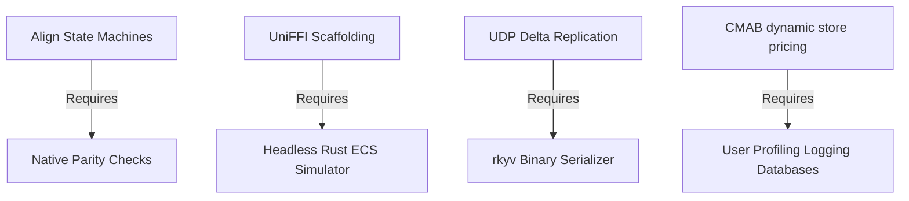

# Production Roadmap: Mobile Fortress
*Milestones, Sprint Pipelines, and Shared Technical Dependencies*

---

## 1. Project Milestones

The development schedule spans four main phases, moving from platform synchronization to advanced procedural gameplay:

```
+-------------------------------------------------------------------------------+
| PHASE 1: Native Parity & Setups (Weeks 1-4)                                   |
| - Standardize game-state machine states across both native clients.          |
| - Build shared levels asset JSON reading framework.                           |
+-------------------------------------------------------------------------------+
                                       |
                                       v
+-------------------------------------------------------------------------------+
| PHASE 2: Rust Core Simulation Engine (Weeks 5-8)                              |
| - Write core ECS simulation in Rust using the hecs library.                   |
| - Build UniFFI pipeline. Expose state updates as rkyv byte buffers.          |
+-------------------------------------------------------------------------------+
                                       |
                                       v
+-------------------------------------------------------------------------------+
| PHASE 3: Cooperative Netcode & AWS (Weeks 9-12)                               |
| - Integrate UDP socket replication. Implement delta compressed state syncs.   |
| - Provision AWS GameLift fleets. Deploy FlexMatch rulesets.                   |
+-------------------------------------------------------------------------------+
                                       |
                                       v
+-------------------------------------------------------------------------------+
| PHASE 4: ML & Math Optimizations (Weeks 13-16)                                |
| - Train and deploy offline PCGRL PPO agent. Deploy WFC local solvers.         |
| - Integrate Imitation-Adversarial DDA loops and CMAB shop bandits.            |
+-------------------------------------------------------------------------------+
```

---

## 2. Sprint Allocations

| Sprint | Objective | Deliverables |
| :--- | :--- | :--- |
| **Sprint 1** | Native Alignment | Shared level JSON loading schemas, synchronized menus/play/pause client loops. |
| **Sprint 2** | Headless Simulation | Rust core hecs ECS simulation, UniFFI FFI bindings, rkyv binary serialization. |
| **Sprint 3** | Multiplayer Sync | Sockets layer, delta compression vectors, AWS GameLift FlexMatch queue rulesets. |
| **Sprint 4** | ML Integration | PCGRL (PPO) map editor, WFC constraint solvers, Imitation DDA, CMAB store bandit. |

---

## 3. Critical Technical Dependencies



1.  **Rust Core Integration depends on Native Alignment**:
    Before substituting the Canvas and SpriteKit loops with Rust calls, both native clients must execute identical state transitions.
2.  **Multiplayer Replication depends on rkyv Serialization**:
    Delta compression replication requires the zero-copy buffer output from rkyv.
3.  **WFC Map Solvers depend on Tile Adjacency schemas**:
    The collapse solver cannot run until terrain boundaries have defined constraint weights.

---
*Document Version: 2.0*  
*Authoritative Reference: design/game_design_document.md*
