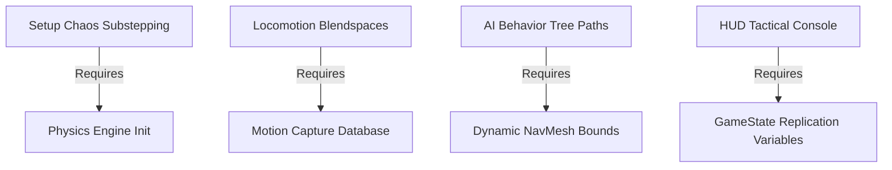

# Production Roadmap: AI Soccer Simulator (AISS)
*Milestones, Sprint Structures, and Critical Technical Dependencies*

---

## 1. Project Milestones

The development schedule spans five distinct phases, moving from core physics setup to release-ready optimization:

```
+-------------------------------------------------------------------------------+
| PHASE 1: Pre-Production & Physics (Weeks 1-4)                                 |
| - Setup UE5 C++ class hierarchy. Config Chaos physics substepping for the ball. |
+-------------------------------------------------------------------------------+
                                       |
                                       v
+-------------------------------------------------------------------------------+
| PHASE 2: Autonomous Locomotion & AI (Weeks 5-8)                               |
| - Implement Motion Matching and pathfinding NavMesh routing.                  |
| - Design basic Behavior Trees and spatial influence mapping queries.          |
+-------------------------------------------------------------------------------+
                                       |
                                       v
+-------------------------------------------------------------------------------+
| PHASE 3: Tactical Interface & HUD (Weeks 9-12)                                |
| - Develop Manager GUI overlays and flat UI HUD structures.                    |
| - Bind GameState variables to UI components. Set up match control triggers.   |
+-------------------------------------------------------------------------------+
                                       |
                                       v
+-------------------------------------------------------------------------------+
| PHASE 4: Audio & Environmental Polish (Weeks 13-16)                            |
| - Set up Lumen lighting profiles and stadium textures.                         |
| - Build MetaSound crowd excitation and spatial audio attenuation networks.     |
+-------------------------------------------------------------------------------+
                                       |
                                       v
+-------------------------------------------------------------------------------+
| PHASE 5: Optimization & Launch (Weeks 17-20)                                  |
| - Profiling CPU execution. Throttling Behavior Tree tick frequencies.         |
| - Final packaging checks, telemetry dumps, and server deployment validation.  |
+-------------------------------------------------------------------------------+
```

---

## 2. Sprint Allocations

| Sprint | Objective | Deliverables |
| :--- | :--- | :--- |
| **Sprint 1** | Physics & Core Loop | Chaos-driven ball physics actor, custom player character hulls, kickoff triggers. |
| **Sprint 2** | AI Systems | NavMesh setup, basic Behavior Tree with task execution, spatial hash grid lookups. |
| **Sprint 3** | Manager controls | HUD scoreboards, tactics console panel, Real-time mentality adjustments. |
| **Sprint 4** | Aesthetics & Audio | Lumen configuration, MetaSound audio attenuation setup, net collision SFX. |
| **Sprint 5** | Optimization & QA | Throttled AI ticks, memory leak profiling, telemetry log dumps. |

---

## 3. Critical Technical Dependencies



1.  **AI Pathfinding depends on NavMesh Setup**:
    AI characters cannot execute navigation tasks until the pitch boundaries have generated NavMesh bounds.
2.  **Locomotion depends on Motion Matching Database**:
    Locomotion blendspaces require the complete mocap data file to query motion indexes correctly.
3.  **UI values depend on replicated State Variables**:
    The HUD scorecard cannot display correct dynamic team variables until they are replicated in `AAISoccerGameState` and bound.

---
*Document Version: 1.0*  
*Authoritative Reference: design/GDD.md*
