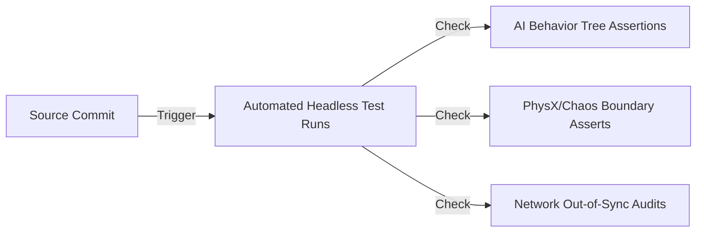

# QA Test Plan: AI Soccer Simulator (AISS)
*Automated Verification, Network Synchronization, and Performance Profiling Standards for UE5*

---

## 1. Quality Assurance Testing Methodologies

AISS uses a hybrid QA approach combining automated headless server runs with manual visual checks.

### 1.1 Automated Headless Simulation Runs
*   **Headless Mode**: The server runs the match simulation without loading graphical assets or spawning a render viewport (`-nullrhi` flag).
*   **Stress Testing**: Runs 100 simultaneous matches in headless mode to verify AI stability, checking for logic deadlocks (e.g., players stopping and not chasing the ball).

### 1.2 AI Behavior Assertions
*   **Verification script checks**:
    *   *Assert 01*: The possessed agent must attempt to intercept the ball when loose.
    *   *Assert 02*: Goalkeepers must remain within the box boundary unless in possession of the ball.
    *   *Assert 03*: Opponent players must select a marking target during defensive phases.

---

## 2. Network Synchronization & Replication Verification

Multiplayer builds require regular verification of replicated states to prevent synchronization drift.

### 2.1 Simulated Network Latency Profiles
Tests are run using Unreal Engine's net emulation settings (`NetEmulationSettings` in `DefaultEngine.ini`):
*   **Profile 1 (Typical)**: Latency: 50ms, Packet Loss: 0.5%, Jitter: 5ms.
*   **Profile 2 (High Jitter)**: Latency: 120ms, Packet Loss: 2.0%, Jitter: 15ms.
*   **Profile 3 (Lossy)**: Latency: 80ms, Packet Loss: 5.0%, Jitter: 8ms.

### 2.2 Desynchronization Audits
*   The server logs ball position coordinate deltas ($X, Y, Z$) against client-side predicted positions every 100ms.
*   If the coordinate delta exceeds a threshold of $15.0\text{ units}$, the test framework raises a warning.

---

## 3. UE5 Profiling & Performance Standards

To guarantee a stable framerate, the simulation must adhere to the following memory and CPU budgets:

### 3.1 Profiling Command Lines
*   `stat FPS`: Displays current framerate.
*   `stat Unit`: Breaks down Frame time, Game thread time, Draw (render) time, and GPU time.
*   `stat Physics`: Tracks Chaos Physics calculation deltas, verifying that substepping does not exceed a 3.0ms budget per frame.

### 3.2 Unreal Insights Integration
*   Match runs are profiled via *Unreal Insights* to detect memory spikes and CPU stall zones.
*   **Targets**:
    *   *Game Thread budget*: $\le 12.0\text{ms}$
    *   *AI Controller evaluation*: $\le 2.0\text{ms}$ (across all 22 agents)
    *   *Rendering (Lumen/Nanite)*: $\le 10.0\text{ms}$

---
*Document Version: 1.0*  
*Authoritative Reference: design/GDD.md*
