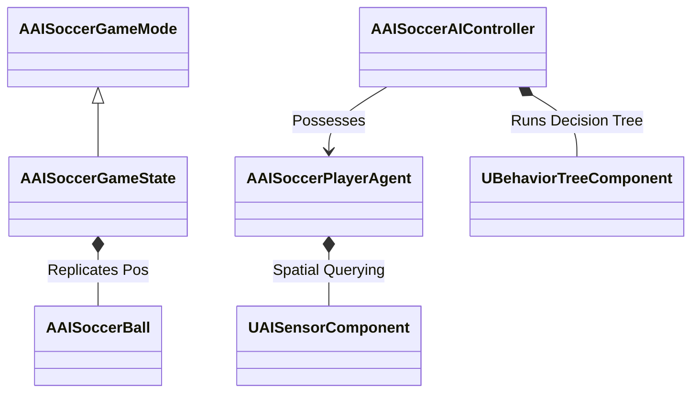

# Technical Design Document (TDD): AI Soccer Simulator (AISS)
*C++ Class Structures, Behavior Trees, and Performance Profiling for Unreal Engine 5*

---

## 1. System Architecture

The AI Soccer Simulator is built on a custom game framework extending Unreal Engine 5 C++ classes. The architecture separates match governance, agent AI controllers, and character actors.



### 1.1 Core C++ Classes
1.  **`AAISoccerGameMode`**:
    *   *Inherits from*: `AGameModeBase`
    *   *Responsibility*: Governs global match rules, referee triggers, and transitions between game states (Kickoff, Active Play, Set Piece). Runs server-side logic only.
2.  **`AAISoccerGameState`**:
    *   *Inherits from*: `AGameStateBase`
    *   *Responsibility*: Replicates match timer, scoreboards, and current active formations. Broadcasts events to client viewports.
3.  **`AAISoccerBall`**:
    *   *Inherits from*: `AActor`
    *   *Responsibility*: Physics actor representing the soccer ball. Employs Chaos Physics with custom substepping enabled for exact velocity and spin vectors. Tracks current owner pointer.
4.  **`AAISoccerPlayerAgent`**:
    *   *Inherits from*: `ACharacter`
    *   *Responsibility*: Physical agent representation on the pitch. Contains attributes (Stamina, Acceleration, Positioning, DribbleSkill, PassingAccuracy). Includes a `UAISensorComponent` for local threat detection.
5.  **`AAISoccerAIController`**:
    *   *Inherits from*: `AAIController`
    *   *Responsibility*: Owns the Behavior Tree and Blackboard components. Directs the pathfinding and state executions of a single possessed `AAISoccerPlayerAgent`.

---

## 2. AI Behavior Trees & Blackboard Configurations

Every player agent runs a customized Behavior Tree that processes tactical roles (Attacker, Midfielder, Defender, Goalkeeper) dynamically.

### 2.1 Blackboard Keys

| Key | Type | Description |
| :--- | :--- | :--- |
| `BallActor` | `Object (AActor)` | Reference to the game ball. |
| `CurrentRole` | `Enum (ETacticalRole)` | Defender, Attacker, Goalkeeper, Support. |
| `TargetLocation` | `Vector` | Target destination vector for NavMesh movement. |
| `OpenRecipient` | `Object (AAISoccerPlayerAgent)` | Best passing target candidate. |
| `IsBallOwner` | `Bool` | Checked if the possessed character is currently dribbling the ball. |

### 2.2 Behavior Tree Topology

```
ROOT
 └── Selector
      ├── Sequence [Has Ball]
      │    ├── Selector
      │    │    ├── Sequence [In Shooting Range]
      │    │    │    └── Task: ShootBall
      │    │    ├── Sequence [Teammate Free & Forward]
      │    │    │    └── Task: PassBall
      │    │    └── Task: DribbleTowardGoal
      ├── Sequence [Ball Is Loose]
      │    └── Task: InterceptBall
      └── Sequence [Defensive Phase]
           ├── Task: MarkTargetPlayer
           └── Task: PositionInFormation
```

---

## 3. Performance & Optimization Targets

To simulate 22 dynamic agents, real-time physics, and stadium rendering at **60 FPS** (16.6ms frame budget), AISS applies strict optimization profiling:

### 3.1 AI Tick Throttling
*   Behavior Tree tasks do not run on `Tick`. Decision nodes execute on a timer:
    *   **Attacker/Ball Handler**: Ticks at 10Hz (every 100ms).
    *   **Off-ball defenders**: Ticks at 5Hz (every 200ms).
*   Pathfinding NavMesh updates are spaced to avoid concurrent calculation spikes on the same frame.

### 3.2 Physics Substepping
*   Unreal Engine's Chaos Physics operates with substepping enabled:
    *   **Substep Delta Time**: `0.005s` (200Hz tick rate for the physics body of the ball).
    *   This guarantees that high-velocity shots do not clip through player collision sweeps or goal bounds.

### 3.3 Spatial Hashing
*   Rather than calculating $O(N^2)$ distance vectors between all 22 players, the pitch uses a 2D spatial hash grid. Agents query their local spatial bucket for threats or passing paths, keeping lookup complexity to $O(1)$.

---
*Document Version: 1.0*  
*Authoritative Reference: design/GDD.md*
