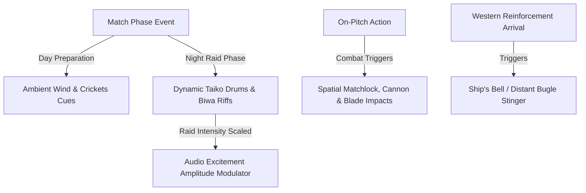

# Audio Design Document (ADD): Mobile Fortress
*Dynamic Taiko Drums, Western Reinforcement Stingers, and Spatial Combat Effects*

---

## 1. Acoustic Identity & Design Philosophy

Mobile Fortress relies on a traditional East Asian acoustic landscape — with sparse Western instrumentation reserved for allied reinforcements — designed to balance peaceful Day phases with intense Night raids.

---

## 2. Dynamic Audio Systems

The soundtrack and ambient environmental loops adjust dynamically using a centralized **Excitement Scale** ($E \in [0.0, 1.0]$) monitored by the game loop:
$$E = w_1 \cdot \text{EnemiesOnScreen} + w_2 \cdot \text{HQHealthLoss} + w_3 \cdot \text{BossPresence}$$

### 2.1 Day / Night Transition Loops
*   **Day Phase ($E < 0.2$)**: Smooth ambient wind sweeps, rustling bamboo/coastal trees, soft crickets, distant flutes (Shakuhachi), and creaking harbor rigging.
*   **Night Phase (Start of wave)**: Rhythmic clapping, tension-building Biwa strings, and light percussion.
*   **Peak Raid ($E \ge 0.6$)**: Loud Taiko drum arrays, aggressive Shamisen strums, and shouting backing vocals, scaling in volume and speed as raiders approach the HQ or an outpost.

---

## 3. Spatial Combat Audio

Sound effects are localized based on screen coordinates to help players recognize where breaches occur, on land or along the coastline.

### 3.1 Weapon SFX Cues
1.  **Fo-lang-ji & Arquebus Fire**: Loud, bass-heavy explosions with high-frequency crackle, dropping in volume if fired off-screen.
2.  **East Asian Archers**: High-velocity arrow whistling sample, fading out at target coordinates.
3.  **Commander Cleaves**: Metallic blade slashing sounds with organic body impacts.
4.  **Naval Broadsides**: Deep, reverberant cannon booms with a distinct water-impact splash tail for near-misses.
5.  **Western Reinforcement Arrival**: Ship's bell (Kagura Suzu-style shimmer layered under a distant bugle call) marking allied naval units entering the map.

---
*Document Version: 3.0*  
*Authoritative Reference: docs/design/game_design_document.md*
