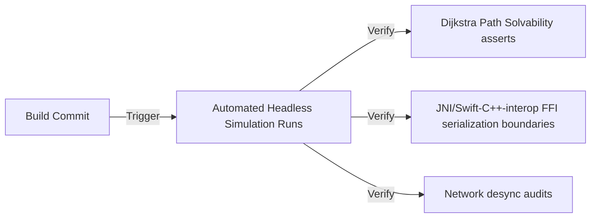

# QA Test Plan: Mobile Fortress
*Automated Simulation Runs, Replication Sync Checks, and Mobile Profiling Standards*

---

## 1. Quality Assurance Testing Methodologies

Mobile Fortress uses automated headless simulation passes combined with on-device rendering validation.

### 1.1 Automated Headless Simulation Runs
*   **Headless Tests**: The game loop is run in a pure C++ test harness (GoogleTest), executing matches without rendering.
*   **Stress Checks**: Simulates matches containing 500 simultaneous entities to verify path recalculation speeds and detect CPU bottlenecks.

### 1.2 Path Solvability Assertions
*   **WFC Level Generator checks**:
    *   *Assert 01*: The Dijkstra map must contain a valid, unblocked pathway from every active spawn gate to the HQ (and, for naval spawn gates, to the nearest Trading Outpost).
    *   *Assert 02*: No generated layouts can exceed the maximum barricade placement budget.

---

## 2. Network Replication Synchronization

To maintain co-op match integrity over mobile network variations, replication checks are run continuously:

### 2.1 Emulated Latency Profiles
*   **Profile 1 (Cellular Typical)**: Latency: 60ms, Packet Loss: 0.5%, Jitter: 5ms.
*   **Profile 2 (Cellular Lossy)**: Latency: 100ms, Packet Loss: 3.0%, Jitter: 12ms.
*   **Profile 3 (Transit/Tunnel)**: Latency: 150ms, Packet Loss: 7.0%, Jitter: 25ms.

### 2.2 Desynchronization Audits
*   The Dedicated Server monitors client position predictions. If coordinate discrepancies exceed a threshold of $0.5\text{ tiles}$ due to dropped packets, a reconciliation snap is executed during wave breaks to avoid visual jitter during intense combat.

---

## 3. On-Device Profiling Standards

To preserve thermal limits and prevent battery drain on targeting hardware (Android API 24+, iOS 16+):

### 3.1 Memory Allocation Targets
*   **Android (Android Studio Profiler)**: Heap memory allocations must remain under $120\text{MB}$. Per-frame allocations inside the `GameLoop` thread body must be $0$ (preventing Garbage Collection pauses).
*   **iOS (Xcode Instruments)**: Active allocations must remain under $100\text{MB}$. ARC release chains are audited to prevent cyclic reference leaks across Swift/C++ FFI borders.

### 3.2 Thread Budget Allocations
*   *Game Loop update tick*: $\le 3.0\text{ms}$
*   *C++ Core Simulation FFI update*: $\le 4.0\text{ms}$
*   *Native presentation rendering*: $\le 8.0\text{ms}$

---
*Document Version: 2.1*  
*Authoritative Reference: docs/design/game_design_document.md*
