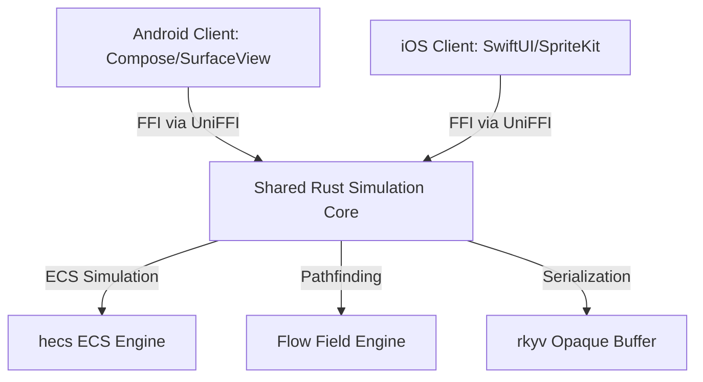

# Technical Design Document (TDD): Mobile Fortress
*Headless Rust Core, UniFFI Bindings, rkyv Serialization, and Flow-Field Pathfinding*

---

## 1. System Architecture

Mobile Fortress uses a cross-platform architectural model: presentation layers are native for maximum UX fidelity, while game simulation, pathfinding, and economics are unified in a headless Rust core.

### 1.1 Core Components
1.  **Shared Rust Simulation Core (`core/`)**:
    *   Written in Rust, exposing a pure C-ABI FFI.
    *   Implements the Entity-Component-System (ECS) pattern using the `hecs` crate.
    *   Governs all game state modifications, wave progress, collision tracking, and path updates.
2.  **UniFFI Scaffolding**:
    *   Generates idiomatic Kotlin bindings for Android and Swift bindings for iOS.
    *   Enables cross-boundary calls and callbacks.
3.  **Zero-Copy Serialization (`rkyv`)**:
    *   Encodes state changes into dense binary byte arrays.
    *   Clients traverse the `RustBuffer` without allocation, eliminating parsing overhead.

---

## 2. Dynamic Flow-Field Pathfinding

To navigate hundreds of dynamic entities on mobile CPU threads, the Rust core runs a vector gradient pathfinder:

### 2.1 Dijkstra Cost Map
*   Terrain tiles are mapped to costs: open path ($1.0$), difficult zone — mudflat/shoal ($2.5$), blockage ($\infty$).
*   Dijkstra's algorithm propagates costs outward from the HQ or targeted outpost ($C(T) = 0$):
    $$C(p) = \min_{n \in \text{Neighbors}(p)} \left( C(n) + \text{Cost}(p \to n) \right)$$

### 2.2 Gradient Vector Field
*   For each tile, a normalized directional vector pointing to the neighbor with the minimum cost is pre-calculated:
    $$V(p) = -\nabla C(p)$$
*   Entities determine their velocity simply by indexing the vector of their current grid coordinate, reducing traversal pathing from $O(N^2)$ to $O(1)$.

---

## 3. Network Synchronization & AWS GameLift

Mobile Fortress features a **Server-Authoritative State Synchronization** model:

### 3.1 Session Matchmaking (FlexMatch)
*   AWS GameLift FlexMatch groups players based on latency telemetry beacons. Lobbies prioritize low latency (<50ms) before relaxing restrictions to 90ms and 120ms during low concurrency hours.

### 3.2 Spot Instance Management
*   Fleets run on 70% Spot Instances (`c5.large`/`c5.xlarge`) to reduce operational costs.
*   If a termination warning is issued, GameLift placement queues divert new sessions to backup On-Demand fleets, and active matches are allowed a 2-minute clean migration window.

---
*Document Version: 2.0*  
*Authoritative Reference: docs/design/game_design_document.md*
